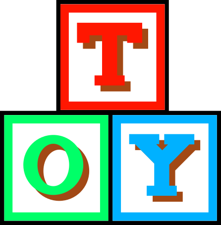

# Toy

This is the Toy programming language interpreter, written in C.

My goal for writing this language is simply to have fun and to learn, but also to create something that *could* be usable in an actual dev environment, particularly as an extension to a game engine.

The docs can be found under docs/, or you could start [here](docs/toy_reference.md).

Special thanks to http://craftinginterpreters.com/ for their fantastic book that set me on this path.

## Building

To build the project, run `make` in the root directory.

# License

Copyright (c) 2020 Kayne Ruse, KR Game Studios

This software is provided 'as-is', without any express or implied warranty. In no event will the authors be held liable for any damages arising from the use of this software.

Permission is granted to anyone to use this software for any purpose, including commercial applications, and to alter it and redistribute it freely, subject to the following restrictions:

1. The origin of this software must not be misrepresented; you must not claim that you wrote the original software. If you use this software in a product, an acknowledgment in the product documentation would be appreciated but is not required.

2. Altered source versions must be plainly marked as such, and must not be misrepresented as being the original software.

3. This notice may not be removed or altered from any source distribution.
