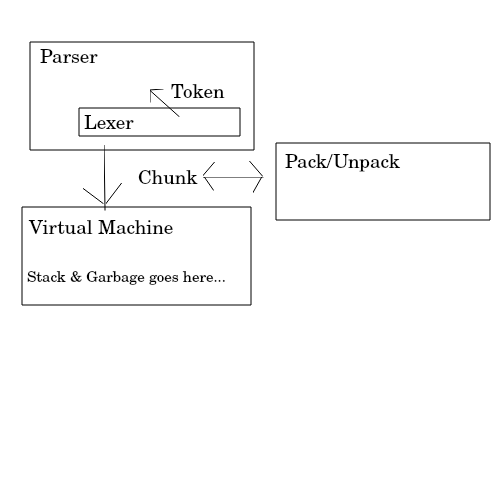

# The Toy Programming Language Tour Guide

18/10/2020

OK, first off, let me state that a lot of things are incomplete - I'm currently rewriting the language to match the 0.4.0 specification, which you can find [here](https://github.com/Ratstail91/Toy/blob/0.4.0/docs/toy_reference.md), while you can find the main branch of development at [https://github.com/Ratstail91/Toy](https://github.com/Ratstail91/Toy).

Secondly, this article is aimed mainly at my non-language-geek friends, who are able to code, but have never even thought of making their own language. So if you're familiar with languages, this might be a bit boring, while if you're not familiar with coding at all, you might be a little lost at times. Still, I'll try to make it as easy and entertaining for all groups as I can.

Finally, this language is supposed to be general purpose, but the main use will be as an embedded language in a much larger C/C++ program. We'll see how well that goal turns out when it's closer to completion.

## The Pipeline

The core of the interpreter has three major steps:

* The Lexer
* The Parser
* The Virtual Machine

However, like everything in life, things are more complicated than a simple `lexer -> parser -> VM` pipe. Instead, you need to include the Tokens and Chunks as intermediaries, as well as the potential for storing Toy programs as files ("packing"). Also, the lexer itself is actually a self-contained component of the parser... so really it looks like this:



Let's start from the very beginning - the source code:

__print.toy__
```
print "Hello world!";
```

This is a simple program which *does* currently work. It gets fed into the interpreter in one of several ways:

* via the repl
* via the file reader
* via the larger program

The `repl`, which stands for Read-Evaluate-Print-Loop, is simply the command-line interpreter. If you've used other popular languages like python, then you've probably seen one of these before.

The interpreter's main.c also supports reading in a `.toy` file, when it's passed in as a command line option. Finally the third method is where the source code is passed to Toy via some other internal process. This probably won't happen too often.

Anyway, once you have the source code, you pass it into a lexer.

```c
Lexer lexer;
initLexer(&lexer, source);
```

This will initialize the lexer, and prime it for emitting a `Token` every time `scanLexer` is called. However, you won't really need to worry about this part; as I said, the lexer is simply part of the larger parser:

```c
Parser parser;
initParser(&parser, &lexer);

Chunk* chunk = scanParser(&parser);

//do stuff here

freeChunk(chunk);
freeParser(&parser);
```

(Side note: Lexers can't be reused, but parsers can after they've been freed and re-initialzed.)

Where the lexer converts source code into tokens, the parser converts tokens into chunks.

(Side note: You'll also notice that there are no abstract syntax trees used - if you don't know what that is, it's basically the tokens arranged into a tree-like structure. Older versions of Toy did this.)

I like to think of lexers as simply representing the source code - as that's what they essentially do. Parsers are the monster that converts their output into usable bytecode, which is stored in the chunks.

Let's have a closer look at chunks, as more and more of the interpreter will depend on them as time goes on:

__chunk.h__
```c
#ifndef TOY_CHUNK_H
#define TOY_CHUNK_H

#include "common.h"
#include "literal.h"

//DOCS: chunks are the intermediaries between parsers and compilers
typedef struct {
	int capacity; //how much space is allocated for the code
	int count; //the current index of the code
	uint8_t* code; //the opcodes + instructions
	int* lines; //for error messages

	LiteralArray literals; //an array of literal values
} Chunk;

void initChunk(Chunk* chunk);
void freeChunk(Chunk* chunk);
void writeChunk(Chunk* chunk, uint8_t val, int line);
void writeChunkLong(Chunk* chunk, uint32_t val, int line);

#endif
```

This structure may change at some point, but currently they have `capacity` and `count` values, which are used by Toy's internal memory allocator to track the memory used. In this case, it's for an array of bytes, stored in the `code` pointer. Then there's an array of integers representing line numbers (carried over from the Tokens; used for error messages), and finally an array of literal values. We'll get to the literals in a minute.

Looking back at our `print.toy` file above, we can break it down into a number of Tokens, and further into instructions:

```
source               token                 opcode
print                TOKEN_PRINT           OP_PRINT
"Hello world!"       TOKEN_STRING          OP_LITERAL
;                    TOKEN_SEMICOLON       -
end of file          TOKEN_EOF             OP_EOF
```

The semicolon is discarded by the chunk stage. Where did the `Hello world!` go? It was copied into the `literals` array:

```c
typedef struct {
	int capacity;
	int count;
	Literal* literals;
} LiteralArray;

void initLiteralArray(LiteralArray* array);
void writeLiteralArray(LiteralArray* array, Literal value);
void freeLiteralArray(LiteralArray* array);
```

The actual literals file is way more complex than this, as it wraps up a number of utility macros as well as the literal structure itself - just know that the `LiteralArray` stores it's memory just like the Chunk does.

By storing the string `Hello world!` into the literal array, now we can simply reference it by it's index. So ultimately, the chunk's code looks like this:

```
push literal  OP_LITERAL
0             (index of the literal to be pushed)
print         OP_PRINT
end           OP_EOF
```

four bytes.

The interpreter is stack-based, so you're going to see a lot of reverse-polish notation if you're working with it (and obviously, it's 0-indexed). However, you probably noticed `writeChunkLong` above, which is simply used to write a "long literal", or a literal who's index is above 255, and thus can't be stored in a single byte - these are stored in 4 bytes.

This four-byte program is enough to be stored into a chunk and passed to the virtual machine. Don't worry, the hard part is done now.

__toy.h__
```c
#ifndef TOY_TOY_H
#define TOY_TOY_H

#include "common.h"
#include "literal.h"
#include "chunk.h"
#include "dictionary.h"

typedef struct {
	bool error; //I've had a runtime error
	bool panic; //I'm processing a runtime error

	int capacity; //capacity of the stack
	int count; //number of literals in the stack
	int* indexes; //array members refer to index within the garbage array

	uint8_t* pc; //program counter

	LiteralArray garbage; //can be cleaned between "declarations"

	Dictionary constants; //a dict of live constants
	Dictionary variables; //a dict of live variables
	//TODO: scope via an array of tables?
} Toy;

void initToy(Toy* toy);
void freeToy(Toy* toy);
void executeChunk(Toy* toy, Chunk* chunk); //pass one chunk at a time

#endif
```

I lied. (Also, I named the virtual machine "Toy" because reasons.)

There's a lot that needs to be implemented still that have been playing on my mind - namely, the `import` keyword and "packing" the chunks into a distributable file. So this structure will likely change and adapt as I need it to - there might be sub-VMs, sub-environments, etc. I really don't have a clue just yet as to what will work. But for now, we'll look at what does work.

`error` and `panic` are simply flags for error handling (the parser has these too). `capacity`, `count`, and `indexes` are memory-allocator variables, we'll get back to indexes in a moment. `pc` is short for "program counter", and is the viable that runs along the chunk's `code` array.

Next, we have `garbage`, which is where the Literals that are no longer needed go - but that's not quite right...

Finally, `constants` and `variables` are just key-value pairs refering to the constants and variables in the program so far.

Let's rewind to `garbage` - This array can theoretically be released between lines of execution i.e. garbage collection, though GC has yet to be implemented. Also, this happens to be where the "live" literals actually live - when you push onto the stack, what you're actually doing is pushing to `garbage` and then pushing it's index into `indexes`, so there's a layer of indirection involved there. This isn't ideal, but it's actually the only way I could retain references to the correct memory addresses while also allowing the memory allocator to do it's thing as it sees fit. Sometimes, you gotta compramise.

Have a look at this file:

__print2.toy__
```
print "Hello world!";
print "Hello world!";
print "Hello world!";
print "Hello world!";
print "Hello world!";
```

How many times do you think `Hello world!` will be saved into the chunk? Would you believe, only once? The parser is just that clever - it knows how to reuse existing literal indexes. I'm planning on implementing the same cleverness into the virtual machine to reduce the memory management around `garbage`.

```c
Toy toy;
initToy(&toy);

executeChunk(&toy, chunk);

freeToy(&toy);
```

The virtual machine is pretty simple, all things considered - it needs to be, since it's the most time-critical piece. If I manage to pack chunks into a distributable file, then the end user will be able to load them up, and run them directly - they might not even need the lexer and parser to be in the main program.

The virtual machine is basically just a switch statement that acts based on the current opcode pointed to by `pc`. One aspect of the virtual machine is that it MUST NOT alter the chunk in any way, shape or form - the same chunk might be reused at some point. I don't have any code to ensure this though - so it's all down to discipline.

There are some optimisations and tricks that the parser pulls on the program - basically simplifying it for the virtual machine. One example of this is the `>=` operator. Instead of coding for this operator, the parser checks `<` then negates the result - two opcodes long, but still perfectly valid.

Finally, I think I need to touch on packing/unpacking and multiple chunk processing. My plan is for the `import` keyword to invoke the processing of a separate piece of code - whether it's a separate source file, or a chunk included in a packaged file. I want it to work smoothly regardless of what or where it is. This is just another challenge that I'll meet when I reach it.

I'm a game developer, always have been, always will be. So my plan is to somehow incorporate this language into a game, though I'm far from doing so at this stage. I do have ideas of what I can do - either allowing modding by exposing some logic, or by making the source code the entire game - but, again, that's a long way off.

If you'd like to read the full source code as it currently stands, you can find it at:

[https://github.com/Ratstail91/Toy](https://github.com/Ratstail91/Toy)

Thanks for reading!

